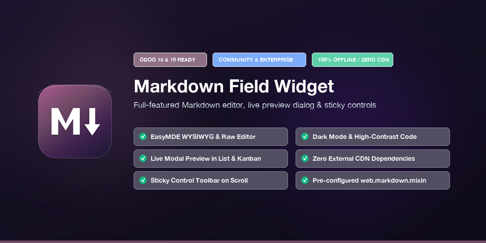

<p align="center">
  
</p>

<p align="center">
  <a href="https://github.com/jeffdali/Web-widget-markdown/blob/19.0/LICENSE"></a>
  
  
  
  
</p>

# Web Markdown Widget (`web_widget_markdown`)

A modern, production-grade Markdown editing and viewing suite built with **OWL 2**, **EasyMDE**, and **marked.js** for **Odoo 18** and **Odoo 19** (Community and Enterprise).

---

## 🌟 Key Highlights

- **✍️ Full-Featured WYSIWYG & Raw Editor (Form View)**: 
  Interactive EasyMDE toolbar equipped with headers, bold, italics, quotes, numbered/bulleted lists, markdown tables, inline code, and code blocks.
- **📌 Sticky Control Toolbar on Scroll**:
  The formatting toolbar remains pinned at the top when scrolling down long content with zero-gap docking beneath Odoo's `.o_control_panel` and proper sticky statusbar clearance.
- **👁️ List & Kanban Preview with Modal Dialog**:
  The `markdown_preview` widget displays a clean, truncated preview (up to 300 characters) in list and kanban views, accompanied by a dedicated **Preview** button that opens the full formatted markdown in a popup modal dialog.
- **🌓 WCAG AAA High-Contrast Dark Mode**:
  Seamlessly integrates with Odoo's native dark mode. Code blocks render in deep slate (`#1e1e2e`) with radiant high-contrast text (`#cdd6f4`), achieving a **10.9:1 contrast ratio** exceeding accessibility standards.
- **🔒 Zero External CDN Dependencies (100% Offline)**:
  All libraries (`EasyMDE`, `marked.js`) and stylesheets are bundled locally within the addon. Satisfies strict corporate, air-gapped, and government security policies.
- **🧩 Developer-Friendly Mixin (`web.markdown.mixin`)**:
  Drop-in abstract model mixin that equips any model with a standardized `description_md` field without writing boilerplate code.

---

## 📸 Screenshots & Showcase

### 1. Form View Editor with Sticky Formatting Toolbar
The control toolbar stays pinned when scrolling through lengthy documents:

```
+-----------------------------------------------------------------------------------+
|  [B]  [I]  [H]  |  [“]  [•]  [1.]  |  [🔗]  [🖼️]  [⊞]  [</>]  |  [👁️]  [◫]  [⛶]  [?]  |  <- Sticky Toolbar
+-----------------------------------------------------------------------------------+
|  # Project Specifications                                                         |
|                                                                                   |
|  - Requirement 1: Fast loading                                                    |
|  - Requirement 2: Clean documentation                                             |
|                                                                                   |
|  ```python                                                                        |
|  def compute_total(self):                                                         |
|      return sum(self.lines.mapped('amount'))                                      |
|  ```                                                                              |
+-----------------------------------------------------------------------------------+
```

### 2. List / Kanban Preview with Modal Dialog
Clicking the **Preview** button opens an interactive modal showing the full rendered Markdown with syntax highlighting:

```
+-----------------------------------------------------------------------------------+
| Title              | Content Preview                                              |
+--------------------+--------------------------------------------------------------+
| Server Setup Guide | Quick overview of deployment instructions...  [Preview]      |
+--------------------+--------------------------------------------------------------+
```

---

## 📦 Installation

### Option A: Direct Git Clone (Recommended)

1. Clone the repository into your custom addons directory:
   ```bash
   # For Odoo 19
   git clone -b 19.0 https://github.com/jeffdali/Web-widget-markdown.git web_widget_markdown

   # For Odoo 18
   git clone -b 18.0 https://github.com/jeffdali/Web-widget-markdown.git web_widget_markdown
   ```

2. Add the path to your Odoo configuration file (`odoo.conf`):
   ```ini
   addons_path = /path/to/odoo/addons,/path/to/your/custom_addons
   ```

3. Restart your Odoo server and update the apps list:
   - Activate **Developer Mode** (`Settings > General Settings > Developer Tools`).
   - Navigate to **Apps > Update Apps List**.
   - Search for `web_widget_markdown` (or `Markdown Field Widget`) and click **Activate**.

---

## 🚀 Usage Guide

### 1. Adding to Form Views (`widget="markdown"`)

Apply `widget="markdown"` to any `fields.Text` or `fields.Html` field in your XML views. In edit mode, it renders the EasyMDE editor; in read-only mode, it renders formatted HTML:

```xml
<record id="view_task_form_markdown" model="ir.ui.view">
    <field name="name">project.task.form.markdown</field>
    <field name="model">project.task</field>
    <field name="inherit_id" ref="project.view_task_form2"/>
    <field name="arch" type="xml">
        <xpath expr="//field[@name='description']" position="attributes">
            <attribute name="widget">markdown</attribute>
            <attribute name="placeholder">Write markdown content here...</attribute>
        </xpath>
    </field>
</record>
```

### 2. Adding to List Views (`widget="markdown_preview"`)

In list/tree views, use `widget="markdown_preview"` to render a clean, single-line preview with an interactive modal popup button:

```xml
<list string="Tasks">
    <field name="name"/>
    <field name="description" widget="markdown_preview"/>
</list>
```

*(For Odoo 18, use `<tree>` instead of `<list>`)*.

### 3. Adding to Kanban Cards

```xml
<kanban>
    <templates>
        <t t-name="card">
            <div class="d-flex flex-column gap-1">
                <strong><field name="name"/></strong>
                <field name="description" widget="markdown_preview"/>
            </div>
        </t>
    </templates>
</kanban>
```

### 4. Using the Python Mixin (`web.markdown.mixin`)

To quickly add a standardized Markdown field to any custom model:

```python
from odoo import models, fields

class ProductTemplate(models.Model):
    _inherit = ["product.template", "web.markdown.mixin"]

    # description_md is automatically added by web.markdown.mixin!
```

---

## ⌨️ Editor Keyboard Shortcuts

| Shortcut | Action |
| :--- | :--- |
| `Ctrl+B` / `Cmd+B` | **Bold** text |
| `Ctrl+I` / `Cmd+I` | *Italic* text |
| `Ctrl+H` / `Cmd+H` | Heading toggle |
| `Ctrl+'` / `Cmd+'` | Blockquote |
| `Ctrl+L` / `Cmd+L` | Ordered list |
| `Ctrl+U` / `Cmd+U` | Unordered list |
| `Ctrl+K` / `Cmd+K` | Insert link |
| `Ctrl+Alt+I` | Insert image |
| `F9` | Toggle side-by-side live preview |
| `F11` | Toggle fullscreen mode |

---

## 🛠️ Architecture & Technologies

| Layer | Technology |
| :--- | :--- |
| **Frontend Framework** | Odoo OWL 2 (`@odoo/owl`) |
| **Field Registry** | `@web/core/registry` (`fields` category) |
| **Editor Engine** | EasyMDE v2.18.0 (CodeMirror 5 under the hood) |
| **Markdown Parser** | marked.js v14.0.0 (safe parsing via OWL `markup()`) |
| **Styling** | SCSS with CSS Variables & Bootstrap 5 |
| **Security** | Zero CDN calls, bundled local assets, sanitized HTML output |

---

## 🧪 Built-in Test Suite

A built-in demo model is included under **Settings > Technical > Markdown > Markdown Test**:
- Create test records with complex Markdown syntax (tables, code snippets, lists, quotes).
- Test form edit mode, live preview, side-by-side mode, and fullscreen editing.
- Test list view and kanban card previews with the preview modal dialog.

---

## 📄 License

This project is licensed under the **GNU Lesser General Public License v3.0 (LGPL-3)** — see the [LICENSE](LICENSE) file for full details.

---

## 🤝 Author & Support

- **Author**: Jaafar Ali
- **Email**: [jaafar.ali.in@gmail.com](mailto:jaafar.ali.in@gmail.com)
- **Repository**: [https://github.com/jeffdali/Web-widget-markdown](https://github.com/jeffdali/Web-widget-markdown)
- **Issues & Contributions**: Bug reports, feature suggestions, and pull requests are warmly welcome!
